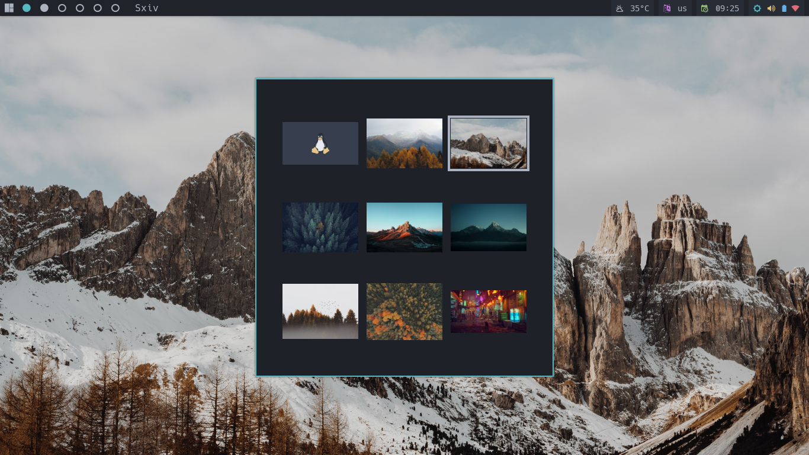

# wall-d

A simple and fast wallpaper manager for x



Features:

- It supports single (same wall on all available screens), dual and triple (different walls on each monitor)
- Uses dmenu or rofi for selecting Mode (single, dual or triple) and options (zoom, tile, center, stretch and no-randr) or (fill, tile, center, scale and no-xinerama) .
- Uses sxiv to preview the wallpapers in thumbnail mode.
- uses xwallpaper or feh to set the wallpaper.
- sxiv window centers in the screen when in floating mode, and respects _.forgorund _.background and \*.font settings from .Xresources.
- pywal support
- betterlockscreen support

Installation:

Install the depencencies:

- sxiv
- dmenu or rofi
- xwallpaper or feh
- pywal (optional)
- betterlockscreen (optional)

Clone the repository

```shell
git clone https://github.com/ronniedroid/Wall-d.git
```

then cd into Wall-d then run install.sh

```shell
cd Wall-d
./install.sh
```

or just copy Wall-d to your `$HOME/.local/bin/` directory and make sure that it is in your PATH.

Usage:

-h print this help message and exit

-d path/to/your/wallpapers/directory

-r restore last set Wallpaper(s)

-p change colorscheme using pywal (Put wal -R in your autostart script to restore last set colorscheme)

-b change betterlockscreen wallpaper too.

-l Only change Betterlockscreen wallpaper.

-n Choose a randome wallpaper(s)

-f Use feh instead of xwallpaper

-R use rofi instead of dmenu

to use Wall-d you must define a wallpapers directory using the `-d` flag.

- Select a mode from the menu and sxiv will open in thumbnail mode. (in case you have only one monitor connected, you will not be prompt to select a mode and sxiv will open directly in single mode)
- mark the wallpaper you want to set with with m, then press q to quit sxiv. (In single mode, the last marked wallpaper will be used. In dual mode, the last two marked wallpapers will be used. The before-last will be set on Monitor1 and the last will be set on Monitor2 and same with triple mode)
- select an option from the menu.
- done

to restore your last set wallpaper(s) use the `-r` flag. put `Wall-d -r` in your autostart script. If you run `Wall-d` with the `-f` flag, then you should put `Wall-d -f -r` in your autostart script.

sxiv usage:

- hjkl to navigate.
- Return: toggle between thumbnail and image mode.
- m: to mark an picture in thumbnail mode.
- b: show details bar about current picture.
- f: toggle fullscreen mode.
- q: to exit.

If anyone has suggestions or can contribute to make the script even better, you are welcome to give your feedback or send a pole request.
